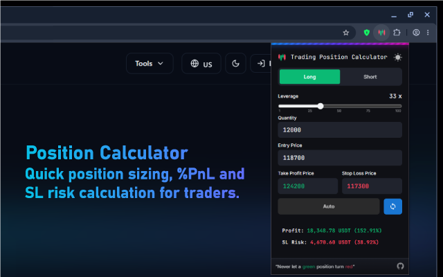
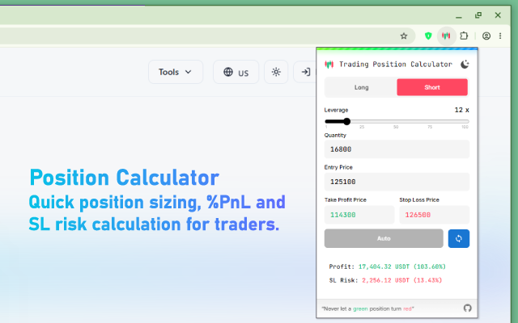

# Position Calculator

### A lightweight Chrome extension for quick position sizing, %PnL and SL risk calculation for traders.
Features:
- Long / Short toggle
- Leverage slider (1x–100x)
- PnL & SL Risk with color indication
- Light / Dark theme (system + manual)
- Clean, minimal UI

[Extension Page](https://chrome.google.com/webstore/detail/positioncalculator)

